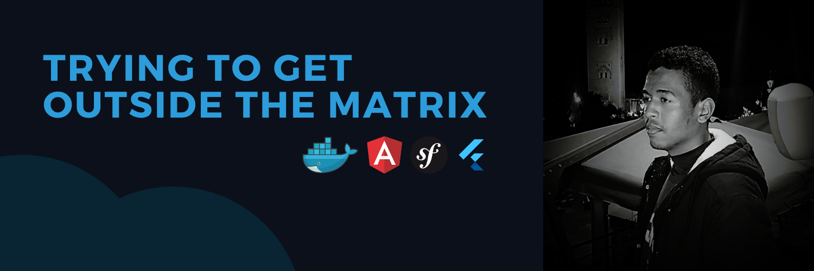

<!--
! DO NOT EDIT THIS FILE. IT IS AUTOGENERATED.
To edit this file, make an edit to its template in `content/templates/README.md.ejs`.
-->

# Hi, I am Rabyâ Raghib 👋

I&#39;m a Morocco-based, self-taught software developer who specializes in building and designing special digital experiences. I am always passionate about learning new things and gaining more knowledge...

 

## 🐱‍🏍 Tech Stack

Here are some of my favorites technologies that I'am comfortable with!

  
  
  
  
  
  
  
  
  

 

## 📊 Github Stats

---

Made with ❤️ by <a href="https://rabraghib.me">Rabyâ Raghib</a>

